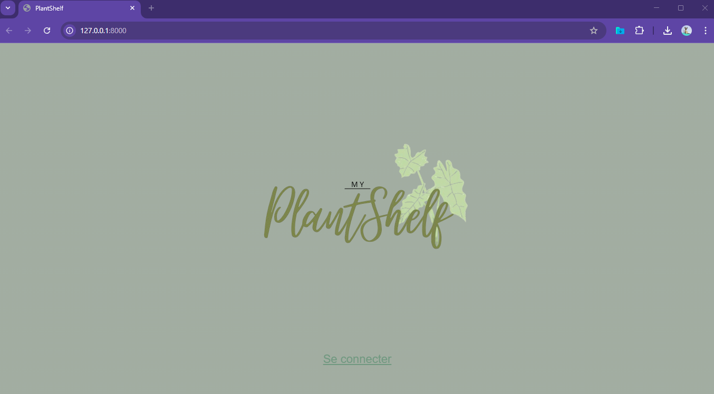

<h1 align="center">🌌 PlantShelf</h1>

  <b>Une application pour répertorier ses plantes et en prendre soin</b> 
   Ajouter vos plantes dans vos différentes pièces et profiter des fonctionnalités afin de les connaitres et d'en prendre soin

---

## 🌱​ Aperçu de l'application

  

---

## ▶️ Lancer l'applicaion

- Connecter vous à votre compte
- Creer votre compte

## 🪴 Contrôles

-- WORK IN PROGRESS  

## 🛠️ Technologies utilisées

Python

Django

## ✨ Features

- Connection
- Gestion de ses plantes
- Gestion de ses pièces
- Notifications
